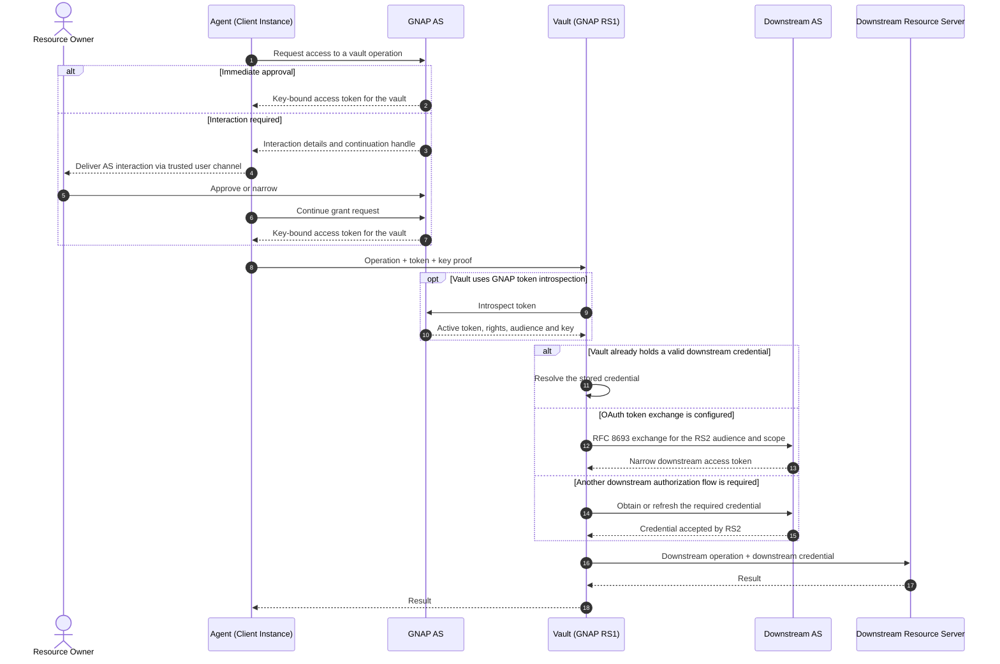

# AGNAP

**Agent Grant Negotiation and Authorization Protocol**

_A grant, not a credential._

AGNAP is an open protocol for giving AI agents narrowly scoped, key-bound
authority without giving them the credentials that make downstream actions
possible.

## The problem

Agents commonly inherit credentials and permissions created for an application
or user account, not for a task, running instance, or subagent. Consider this
instruction:

> Book one hotel below USD 300 and pay a deposit of at most USD 50. Do not send
> messages.

The available credentials may still authorize every email in the account,
unlimited bookings, broader spending, and message delivery. The credential
answers _what can this account do?_ The task asks _what may this particular
agent execution cause to happen?_

AGNAP makes that second question explicit:

> Which agent instance may perform which operation, on which resource, under
> which constraints, and what may it delegate?

## How it works

Each agent is a GNAP client instance with its own cryptographic key. It requests
structured authority from a GNAP Authorization Server (AS) and receives an
access token bound to that key. The agent presents the token and a proof over
its operation request to the **vault**: AGNAP's execution boundary and GNAP
resource server (RS1).

GNAP generally permits bearer access tokens. The AGNAP profile deliberately
does not issue them to agents: an agent-facing token is always bound to that
agent instance's key and is intended for the vault. The vault can still hold
and use a downstream bearer credential when an existing service requires one,
but that credential is never returned to the agent.

In the complete design, the vault verifies the token, key proof, operation,
arguments, time window, and remaining ceilings. Only then does it use the
credential understood by the downstream service. The agent receives the
result, never the credential.

The grant exchange follows
[RFC 9635's overall protocol sequence](https://www.rfc-editor.org/rfc/rfc9635.html#section-1.6.1),
including optional resource-owner interaction and continuation before token
issuance.

Agent runtimes can deliver AS-generated interaction through existing trusted
channels such as Slack or email. The channel only carries the redirect, user
code, or status. Approval remains bound to the Authorization Server and must be
distinguishable from ordinary agent messages.



The downstream credential can be an OAuth access token, API key, payment
mandate, or any artifact the downstream service already understands. AGNAP is
the authorization layer above that system, not a replacement for it.

See [Downstream credentials](docs/downstream-credentials.md) for the supported
credential modes, including OAuth token exchange and GNAP downstream-token
derivation.

## Security properties

The design targets:

- Key-bound authority for each agent instance.
- Enforcement outside the model and agent runtime.
- Closed-world operation and argument constraints.
- Downstream credentials isolated inside the vault.
- Delegation that narrows by default and escalates widening to the owner.
- Revocation and ceilings shared across a delegation tree.

## Authority model

An authority answers: **which operation may the agent invoke, and which
arguments may it use?**

Each entry under `operations` names one callable operation. Inside it, every
argument is paired with a constraint. The following authority permits payments
only to one recipient, in USD, with a per-payment limit of 100 USD. It limits
the authority and its descendants to business hours on 10 September 2026,
three calls, and 200 USD in total:

```json
{
  "type": "agent_operation",
  "operations": {
    "payment.create": {
      "recipient": { "exact": "merchant:acme" },
      "amount": { "range": { "min": "0.01", "max": "100.00" } },
      "currency": { "exact": "USD" }
    }
  },
  "validity": {
    "not_before": "2026-09-10T09:00:00Z",
    "not_after": "2026-09-10T17:00:00Z"
  },
  "ceilings": {
    "payment.create": { "calls": 3 },
    "payment.create.amount": { "total": "200.00", "currency": "USD" }
  }
}
```

This is a closed-world model:

- A 75 USD payment to `merchant:acme` is permitted while budget remains.
- A payment above 100 USD or to another recipient is denied.
- A payment before 09:00 UTC or at or after 17:00 UTC is denied.
- An additional argument is denied because the authority does not name it.
- A fourth payment, or one taking cumulative spend above 200 USD, is denied.
- Any operation other than `payment.create` is denied.

## Delegation narrows authority

When a parent spawns a child, the child becomes a new client instance with a
new key and a grant contained by its parent's grant:

```text
Root: read travel email, book ≤ USD 300, deposit ≤ USD 50
  ├── Search agent: read travel email only
  └── Booking agent: book one hotel ≤ USD 300
        └── Payment agent: deposit ≤ USD 50 to the selected hotel
```

Contained child grants do not require user approval. A wider request is denied
unless the root delegation policy explicitly allows escalation through GNAP
interaction and continuation. Shared ceilings ensure that concurrent siblings
cannot multiply authority by each receiving a fresh copy of the parent's
remaining budget.

See the [detailed delegation sequence](docs/delegation.md) for the complete
parent, child, Authorization Server, vault, and downstream flow.

## Why GNAP?

[GNAP](https://www.rfc-editor.org/rfc/rfc9635) provides several primitives in
one protocol that fit agent execution:

- Client instances can present their own keys without a registration ceremony.
- Access tokens are key-bound by default; the AGNAP profile requires this mode
  for every agent-facing token.
- Structured access objects can describe application-specific rights.
- Interaction and continuation support authorization that cannot complete in a
  single request.
- HTTP Message Signatures can cover the operation request and its body.
- [RFC 9767](https://www.rfc-editor.org/rfc/rfc9767) defines how resource
  servers discover Authorization Servers and validate token state.

The `agent_operation` access type, temporal validity, contained delegation,
receipts, credential references, and conserved ceilings are AGNAP extensions.
They are the intended scope of a future Internet-Draft, not features claimed to
exist in GNAP itself.

## Specification layout

```text
packages/specs/
├── openapi/
│   ├── as.yaml          Authorization Server grant and introspection API
│   └── vault.yaml       Vault operation invocation HTTP API
├── schema/
│   ├── authority.json   Operations, constraints, validity, and ceilings
│   └── delegation.json  Delegation assertions and receipts
├── VERSION              Shared specification version
├── CHANGELOG.md         Deliberate departures from Open Payments
└── README.md            Specification conventions and workflow
```

The OpenAPI 3.1 documents reference the JSON Schema 2020-12 documents rather
than duplicating their definitions. All specification files share one version
and are intended to be consumed together.

## Implementation roadmap

1. **Core:** protocol types, validation, authority checks, keys, and signatures
   in `@agnap/core`.
2. **Services:** the Authorization Server and credential-isolating vault.
3. **Clients:** `@agnap/client`, followed by DeepSeek Harness, Goose, Codex and other
   agent-runtime integrations.
4. **Delegation:** contained child grants, revocation, shared ceilings, and
   audit evidence.
5. **Hardening:** conformance tests, persistent deployments, interoperability,
   security review, and an Internet-Draft.

## Participate

AGNAP is being developed in the open. Feedback is especially welcome from
people working on GNAP and OAuth, capability security, agent runtimes,
payments, and safety evaluations. Useful early contributions include schema
review, threat analysis, protocol examples, test vectors, and independent
implementations.

Use [GitHub Issues](https://github.com/daevmithran/agnap/issues) to propose a
change, identify an ambiguity, or discuss an integration. See
[CONTRIBUTING.md](CONTRIBUTING.md) before opening a pull request, and follow the
[Code of Conduct](CODE_OF_CONDUCT.md). Report security-sensitive issues through
the private process in [SECURITY.md](SECURITY.md).

## Funding and collaboration

The project is seeking grant support and institutional collaborators to fund
specification hardening, interoperability work, reference implementations,
security review, and the path to an Internet-Draft. Programs working on safe
agent deployment, digital identity, payments, or open internet infrastructure
are natural partners.

## License

AGNAP is available under the [Apache License 2.0](LICENSE).
