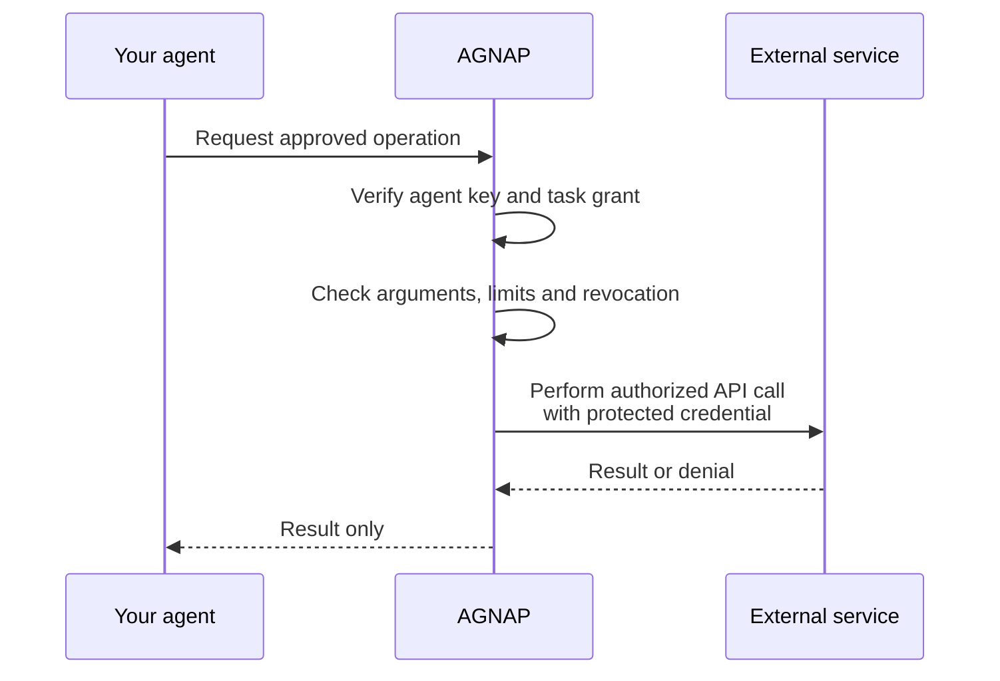
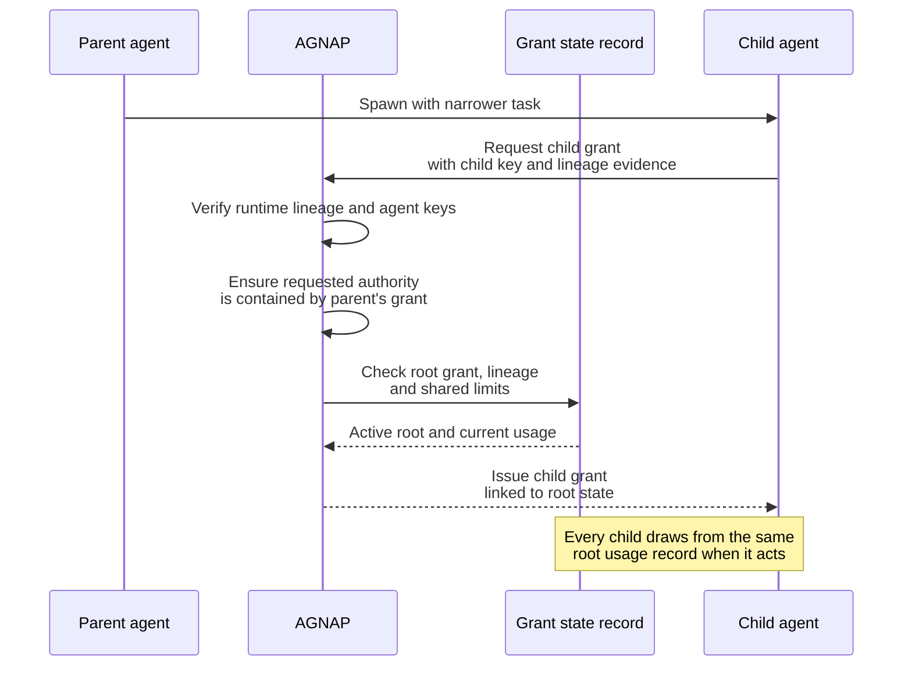

# AGNAP

**Agent Grant Negotiation and Authorization Protocol**

_A grant, not a credential._

AGNAP is an open protocol for giving AI agents narrowly scoped, key-bound
authority without giving them the credentials that make downstream actions
possible.

## The problem

Agents commonly inherit credentials and permissions created for an application
or user account, not for a task, running instance, or subagent. Consider this
instruction:

> Find and book one hotel for my 14–16 October conference trip, within five
> kilometres of the venue. Read only travel-related email, make at most one
> reservation costing no more than USD 300, and pay at most one USD 50 deposit
> to the selected hotel's verified merchant. Do not send messages or change any
> existing booking. All authority expires when the task ends.

The available credentials may still authorize every email in the account,
unlimited bookings, broader spending, and message delivery. The credential
answers _what can this account do?_ The task asks _what may this particular
agent execution cause to happen?_

One application credential cannot express this task-specific boundary or
distinguish one running agent's authority from the application's broader
account access. AGNAP makes the missing question explicit:

> Which agent instance may perform which operation, on which resource, under
> which constraints, and what may it delegate?

## The trust boundary

AGNAP is an internal authorization plane between a user or organization and the
agent executions acting for it. Downstream services remain unchanged: the vault
uses the OAuth token, API key, payment mandate, or other credential they already
accept.

The user or organization sets the root agent's permission and the delegation
settings. The Authorization Server issues a separate grant bound to the running
agent's key. Agents do not share an application token. Child agents receive
their own grants, derived from the parent's as described under
[delegation](#delegation-narrows-authority). The vault remains outside the model
and runtime. It checks the grant before it performs an operation.

## How it works

Each agent is a GNAP client instance with its own cryptographic key. It requests
structured authority from a GNAP Authorization Server (AS) and receives an
access token bound to that key. The agent presents the token and a proof over
its operation request to the **vault**: AGNAP's execution boundary and GNAP
resource server (RS1).

The vault verifies the token, key proof, operation, arguments, time window, and
remaining ceilings. Only then does it use the credential understood by the
downstream service. The agent receives the result, never the credential.

The grant exchange follows
[RFC 9635's overall protocol sequence](https://www.rfc-editor.org/rfc/rfc9635.html#section-1.6.1),
including optional resource-owner interaction and continuation before token
issuance. Immediate issue means only that the owner's initial permission already
covers the request; the Authorization Server asks the owner again when the task
needs permission outside that initial permission or its current grant.

Agent runtimes can deliver AS-generated interaction through existing trusted
channels such as Slack or email. The channel only carries the redirect, user
code, or status. Approval remains bound to the Authorization Server and must be
distinguishable from ordinary agent messages.



In this simplified view, **AGNAP** includes the Authorization Server and the
vault execution boundary. They remain separate protocol roles in the detailed
architecture.

See the [detailed authorization and execution sequence](docs/operation-flow.md)
for the resource owner, runtime, Authorization Server, vault, and downstream
roles.

The effective permission is the intersection of the task grant, vault policy,
stored downstream credential, and downstream service checks. A broad credential
cannot widen the task grant. A narrow credential can still prevent an operation
because AGNAP cannot create authority that the credential does not have. AGNAP
is the authorization layer above the downstream system, not a replacement for
it.

## Why GNAP?

[GNAP](https://www.rfc-editor.org/rfc/rfc9635) provides several primitives in
one protocol that fit agent execution:

- Client instances can present their own keys without a registration ceremony.
- Access tokens are key-bound by default.
- Structured access objects can describe application-specific rights.
- Interaction and continuation support authorization that cannot complete in a
  single request.
- HTTP Message Signatures can cover the operation request and its body.
- [RFC 9767](https://www.rfc-editor.org/rfc/rfc9767) defines how resource
  servers discover Authorization Servers and validate token state.

The `agent_operation` access type, temporal validity, contained delegation,
receipts, credential references, and conserved ceilings are AGNAP extensions.
They are the intended scope of a future Internet-Draft, not features claimed to
exist in GNAP itself.

## Security properties

The design targets:

- Key-bound authority for each agent instance.
- Enforcement outside the model and agent runtime.
- Closed-world operation and argument constraints.
- Downstream credentials isolated inside the vault.
- Delegation that narrows by default and escalates widening to the owner.
- Revocation and ceilings shared across a delegation tree.

## Delegation narrows authority

When a parent spawns a child, the parent requests the permission that the child
needs. It does not grant that permission. The child becomes a new client
instance with a new key. The runtime provides trusted evidence that this parent
started this child. The Authorization Server derives the final child grant from
the request, the parent grant, the owner's delegation mode and maximum depth,
and the shared task limits. Application code does not construct a second,
parallel tree of authorization sessions to describe the tree the runtime already
owns.



The vault owns the grant state record. Child grants reference the same root
state rather than receiving copied call or spend limits, so concurrent siblings
cannot multiply the task's authority.

For example, authority can narrow down a spawn tree:

```text
Root: read travel email, book ≤ USD 300, deposit ≤ USD 50
  ├── Search agent: read travel email only
  └── Booking agent: book one hotel ≤ USD 300
        └── Payment agent: deposit ≤ USD 50 to the selected hotel
```

The user or organization selects the delegation mode. In automatic mode, a child
grant within the parent grant, maximum depth, and shared task limits does not
require another user interaction. If the child needs additional permission, the
operation pauses and the Authorization Server asks the owner. In manual mode,
the Authorization Server asks the owner to approve every child grant. If the
owner has prohibited requests for additional permission, the request is denied.
In every mode, an agent cannot approve its own request.

Quantitative ceilings such as spend or call counts are conserved across
concurrent siblings by a root grant usage record, not copied into each child.
The vault owns that record, keyed by root grant, limit, partition, and window.
On each call it checks the arguments and reserves against the record
atomically, makes the downstream call once with the referenced credential, and
then settles, releases, or holds. An indeterminate outcome is held and
reconciled, never retried automatically unless the downstream API is
idempotent. The audit record carries the receipt chain and only the result
returns to the agent.

See the [detailed delegation sequence](docs/delegation.md) for the complete
parent, child, Authorization Server, vault, and downstream flow.

## Authority model

An effective authorization decision combines four separate things:

1. **Instance binding:** which agent key is presenting the request and which
   AGNAP deployment the token targets.
2. **Granted authority:** the immutable operations, argument constraints,
   validity window, and ceiling definitions approved for that instance.
3. **Grant state:** whether the grant or any ancestor is revoked, plus the
   shared usage and outstanding reservations for the root grant.
4. **Execution authority:** vault policy and the downstream credential's own
   permissions.

The agent carries the key-bound token containing or referencing the granted
authority. Mutable grant state remains server-side. It is not copied into the
token or into each child grant.

### Granted authority

The `agent_operation` access type answers: **which operation may this agent
invoke, with which arguments, and within which static bounds?** Each operation
names every argument the caller may supply. Arguments and operations not named
by the authority are denied.

The following target authority permits payments only to one recipient, in USD,
with a per-payment limit of 100 USD. It limits the authority and all descendants
to business hours on 10 September 2026, three calls, and 200 USD in total:

```json
{
  "type": "agent_operation",
  "operations": {
    "payment.create": {
      "recipient": { "exact": "merchant:acme" },
      "amount": { "range": { "min": "0.01", "max": "100.00" } },
      "currency": { "exact": "USD" }
    }
  },
  "validity": {
    "not_before": "2026-09-10T09:00:00Z",
    "not_after": "2026-09-10T17:00:00Z"
  },
  "ceilings": {
    "payment.create": { "calls": 3 },
    "payment.create.amount": { "total": "200.00", "currency": "USD" }
  }
}
```

### Grant state

Ceilings are definitions in the authority; their changing consumption belongs
to the root grant's state record. Conceptually, the vault maintains state like
this—the representation is internal, not an AGNAP wire object:

```json
{
  "root_grant_ref": "grant:trip-2026-09-10",
  "status": "active",
  "usage": [
    {
      "operation": "payment.create",
      "metric": "calls",
      "limit": 3,
      "settled": 1,
      "reserved": 1
    },
    {
      "operation": "payment.create",
      "argument": "amount",
      "metric": "sum",
      "limit": "200.00",
      "currency": "USD",
      "settled": "75.00",
      "reserved": "50.00"
    }
  ]
}
```

Before an effectful call, the vault atomically reserves the relevant usage. It
then settles the reservation on success, releases it on a definitive failure,
or holds it when the downstream outcome is unknown. Every descendant draws
from this same record, so concurrent siblings cannot multiply the root budget.

### Decision rules

The model is closed-world and fail-closed:

- A 75 USD payment to `merchant:acme` is permitted while budget remains.
- A payment above 100 USD or to another recipient is denied.
- A payment before 09:00 UTC or at or after 17:00 UTC is denied.
- An additional argument is denied because the authority does not name it.
- A fourth payment, or one taking cumulative spend above 200 USD, is denied.
- Any operation other than `payment.create` is denied.

Every constraint kind must define both value evaluation—does this call satisfy
the constraint?—and containment—does the parent constraint subsume the child
constraint? Cross-kind containment must be explicit: a wildcard parent may
contain a range child, which may contain an exact child. An undecidable
comparison is denied or escalated, never treated as permission. Argument
requiredness must remain separate from the constraint on an argument's value.

## Related work

AGNAP does not claim that gateways, vaults, human approval, or narrowing child
permissions are new ideas. The closest work, and where AGNAP differs:

- [Attenuating Agent Tokens (AAT)](https://datatracker.ietf.org/doc/draft-niyikiza-oauth-attenuating-agent-tokens/):
  offline, holder-derived token chains that narrow tools, arguments, lifetime,
  and depth. Revocation and use counting are out of scope, and the tool still
  holds the credential.
- [Credential Delegation Protocol](https://datatracker.ietf.org/doc/draft-sweeney-wimse-credential-delegation/):
  a Delegation Server that vaults credentials and exercises them for a
  DPoP-bound token, with strict-subset sub-delegation, chain receipts, and
  cascade revocation. Nothing conserves a limit across siblings.
- [Delegation Without Trust](https://arxiv.org/abs/2609.00267): measures an
  attenuating, workload-bound broker against compromised subagents and replay.
  It does not isolate credential custody or enforce shared ceilings.
- [AAuth](https://datatracker.ietf.org/doc/html/draft-hardt-oauth-aauth-protocol-10):
  gives subagents their own keys under a parent's consent and argues against
  GNAP for agents.
- [Caracal](https://github.com/Garudex-Labs/caracal): the closest implemented
  system. It authenticates an Application whose code creates Sessions and
  Delegations; AGNAP grants to independently keyed executions with
  runtime-proved lineage and conserves ceilings across siblings.
- [Amazon Bedrock AgentCore Policy](https://docs.aws.amazon.com/bedrock-agentcore/latest/devguide/policy-core-concepts.html):
  checks tool names and arguments outside the agent, with approval, call counts,
  and running totals per application-created policy session. The authority unit
  is that session, not a keyed runtime process.
- [CaMeL](https://arxiv.org/abs/2503.18813) and
  [ScopeGate](https://arxiv.org/abs/2606.28679): enforce outside the model
  before effects, but leave open what authority is presented and who holds the
  credential.
- [AP2](https://github.com/google-agentic-commerce/AP2/blob/main/docs/ap2/specification.md):
  signed payment mandates the vault could produce or use. Agent-to-agent
  delegation is outside its scope.

## Implementation roadmap

1. **Core:** protocol types, validation, authority checks, keys, and signatures
   in `@agnap/core`.
2. **Services:** the Authorization Server and credential-isolating vault.
3. **Clients:** `@agnap/client`, followed by DeepSeek Harness, Goose, Codex and
   other agent-runtime integrations.
4. **Delegation:** contained child grants, revocation, shared ceilings, and
   audit evidence.
5. **Hardening:** conformance tests, persistent deployments, interoperability,
   security review, and an Internet-Draft.

## Participate

AGNAP is being developed in the open. Feedback is especially welcome from people
working on GNAP and OAuth, capability security, agent runtimes, payments, and
safety evaluations. Useful early contributions include schema review, threat
analysis, protocol examples, test vectors, and independent implementations.

Use [GitHub Issues](https://github.com/daevmithran/agnap/issues) to propose a
change, identify an ambiguity, or discuss an integration. See
[CONTRIBUTING.md](CONTRIBUTING.md) before opening a pull request, and follow the
[Code of Conduct](CODE_OF_CONDUCT.md). Report security-sensitive issues through
the private process in [SECURITY.md](SECURITY.md).

## Funding and collaboration

The project is seeking grant support and institutional collaborators to fund
specification hardening, interoperability work, reference implementations,
security review, and the path to an Internet-Draft. Programs working on safe
agent deployment, digital identity, payments, or open internet infrastructure
are natural partners.

## License

AGNAP is available under the [Apache License 2.0](LICENSE).
