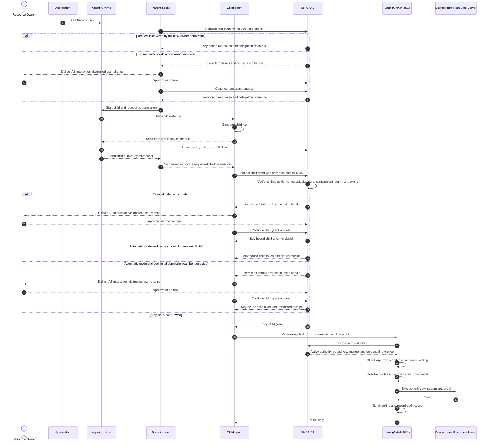

# Delegation flow

This is an informative view of AGNAP's planned parent-to-child delegation
flow. The normative wire formats are defined in
[`schema/delegation.json`](../packages/specs/schema/delegation.json).

The user or organization can require a new decision for every root task or set
a small initial permission for verified agent instances. Zero permission is
the recommended default, not a protocol requirement. In both cases, the AS
issues a separate key-bound grant to the running instance. Each child is a
distinct GNAP client instance with its own key. The parent requests the
permission that the child needs. It does not grant that permission. The runtime
proves the parent and child relationship. The Authorization Server derives the
final child grant from the request, the parent grant, the owner's delegation
mode, and the shared task limits. The vault enforces the grant.

When resource-owner interaction is required, the runtime can hand the
AS-generated interaction to a trusted adapter for delivery through an existing
user channel. The channel carries the interaction but does not approve the
grant. Approval remains bound to the Authorization Server.

The important invariants are:

- The child token is bound to the child's key, not the parent's.
- The AS issues a child grant only after it receives matching runtime evidence.
- The parent requests child permission but cannot grant it.
- Automatic mode does not require owner interaction for a child request within
  the parent grant, maximum depth, and shared task limits.
- Manual mode requires owner interaction for every child grant.
- Additional permission is rejected unless the owner allows a new approval.
- A child cannot approve its own widening.
- Descendants share the ancestor's ceilings rather than receiving copies.
- Revoking an ancestor makes its descendants unusable at the vault.
- Downstream credentials never enter either agent runtime.

The runtime-evidence message is part of the planned design. The current schema
does not yet define its wire format or trusted transport.
