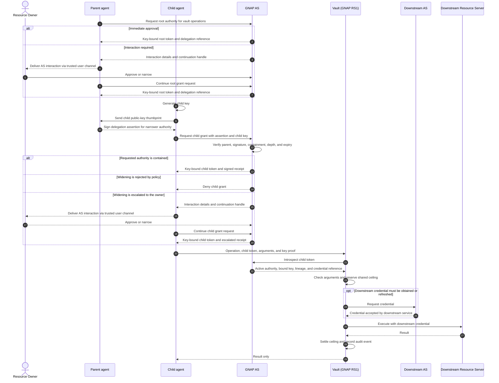

# Delegation flow

This is an informative view of AGNAP's planned parent-to-child delegation
flow. The normative wire formats are defined in
[`schema/delegation.json`](../packages/specs/schema/delegation.json).

Each child is a distinct GNAP client instance with its own key. The parent
authorizes the child to request a subset of its authority, while the
Authorization Server verifies containment and the vault enforces the resulting
grant.

When resource-owner interaction is required, the runtime can hand the
AS-generated interaction to a trusted adapter for delivery through an existing
user channel. The channel carries the interaction but does not approve the
grant. Approval remains bound to the Authorization Server.

The important invariants are:

- The child token is bound to the child's key, not the parent's.
- A contained child grant does not require resource-owner interaction.
- Widening is rejected unless the root policy allows owner escalation.
- A child cannot approve its own widening.
- Descendants share the ancestor's ceilings rather than receiving copies.
- Revoking an ancestor makes its descendants unusable at the vault.
- Downstream credentials never enter either agent runtime.
