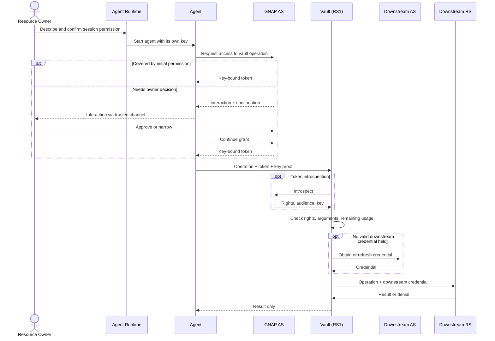

# Authorization and execution sequence

This is the detailed version of the simplified AGNAP flow in the project
README. It keeps the Authorization Server, vault, downstream authorization
system, and downstream resource server visible as separate protocol roles.

